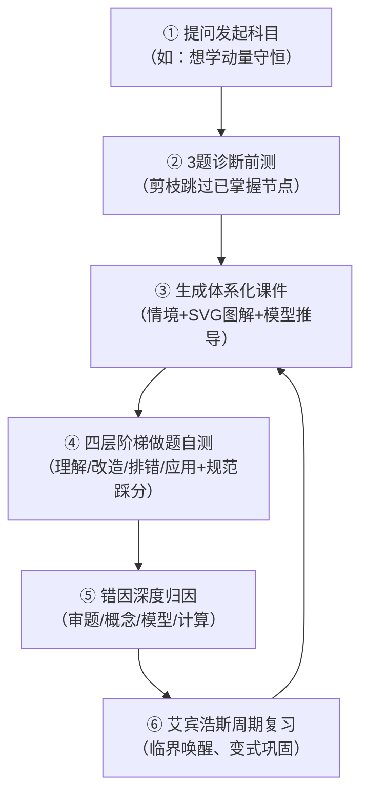

# StudyMate-HighSchool · 高中自学智能体完全使用指南

> **适用对象**：高中学生（当前学员：**Elias**，高二上学期，新高考全国I卷）  
> **核心学科**：物理、数学、化学、生物、语文等高中全科  
> **本地访问**：[http://localhost:3000/](http://localhost:3000/)  
> **核心设计哲学**：从具体到抽象、从模型到规律、从例题到变式、从错因到掌握

---

## 目录

1. [系统简介与核心特性](#一系统简介与核心特性)
2. [快速上手（3分钟开启自学）](#二快速上手3分钟开启自学)
3. [核心学习闭环（六步自学法）](#三核心学习闭环六步自学法)
   - [第一步：发起新科目与考点规划](#第一步发起新科目与考点规划)
   - [第二步：极速水平诊断与动态大纲](#第二步极速水平诊断与动态大纲)
   - [第三步：交互式课件精读与物理图景](#第三步交互式课件精读与物理图景)
   - [第四步：四层认知阶梯做题与规范踩分](#第四步四层认知阶梯做题与规范踩分)
   - [第五步：四类错因归因与错题沉淀](#第五步四类错因归因与错题沉淀)
   - [第六步：艾宾浩斯记忆周期循环复习](#第六步艾宾浩斯记忆周期循环复习)
4. [常用对话指令速查表 (Cheat Sheet)](#四常用对话指令速查表-cheat-sheet)
5. [本地工作区架构与数据流转](#五本地工作区架构与数据流转)
6. [命令行工具与常见维护](#六命令行工具与常见维护)
7. [常见问题解答 (FAQ)](#七常见问题解答-faq)

---

## 一、系统简介与核心特性

StudyMate-HighSchool 是一套运行在本地的**高中全科自学智能体系统**。它将大语言模型与本地交互式 Web 知识库深度融合，针对高中备考（尤其是理科）的痛点，提供了四个核心能力：

1. **直观图景先行（矢量物理/几何图解）**：拒绝纯死记硬背公式，所有受力分析、运动轨迹、几何剖面均使用规范 SVG 矢量图解直观呈现。
2. **动态大纲与水平诊断**：通过 3~5 道诊断题准确定位已有知识与断层，跳过已掌握内容，定制专属学习路径。
3. **四层认知进阶练习**：每一考点均按「理解 → 改造 → 排错 → 应用」分层阶梯出题，大题提供规范步骤与采分点清单自查。
4. **认知错因归因与艾宾浩斯复习**：学生答错时不只给答案，而是深入归入「审题遗漏 / 概念混淆 / 模型套错 / 计算失误」四类错因，并按照遗忘曲线在看板中自动提醒复习。

---

## 二、快速上手（3分钟开启自学）

### 1. 启动本地 Web 服务
在终端执行以下命令（平时智能体已在后台启动）：
```bash
py scripts/serve.py --workspace workspace --port 3000
```
然后在浏览器中打开：**`http://localhost:3000/`**

### 2. 看板核心模块概览
打开主页后，你会看到清晰的 Figma Bento Grid 看板布局：
- **顶栏**：倒计时胶囊（`距高考 256 天`）、深浅色主题切换开关、学员信息胶囊（`Elias · 高二上学期`）。
- **指标行**：进行中科目数、学科总数、已掌握学科数、综合掌握度进度环。
- **学情备考档案（左卡）**：考区卷型、目标分数（85-95分）、认知风格偏好、重点关注学科，支持点击一键复制诊断自测指令。
- **艾宾浩斯复习计划（右卡）**：6 轴学科能力雷达图、四类错因分布统计、今日待复习错题提示与复习启动入口。
- **学科列表**：按状态（全部 / 进行中 / 暂停 / 已掌握）分段筛选与搜索，点击卡片即可进入对应的学科大纲路线图。
- **AI 学习助手条**：底部伴学入口，支持一键发起新科目规划。

---

## 三、核心学习闭环（六步自学法）



---

### 第一步：发起新科目与考点规划
告诉 Agent 你当前想学的高中模块或考点。

**对话示例**：
> “我想自学高中物理牛顿第二定律传送带模型，请帮我规划大纲。”  
> “我想系统学高中数学导数的极值与单调性讨论。”

**系统产出**：
- Agent 会调用 `curriculum-designer`，根据高中新课标大纲，在 `workspace/.learning/subjects/<学科名>/` 下自动创建 `curriculum.yaml`。
- 大纲按照由浅入深的层次组织（如：第 1 层基础概念 → 第 2 层动力学核心模型 → 第 3 层综合应用与实验）。

---

### 第二步：极速水平诊断与动态大纲
如果你对该模块已经有部分基础，不需要从零开始：

**对话示例**：
> “测测我的水平，帮我定制大纲。”  
> “传送带这块我好像基本公式都会，考我两道题看看能不能跳过前面的基础课？”

**系统处理**：
- Agent 调取 `diagnostic-onboarding` 技能，抛出 3 道典型探针题。
- 根据你的作答，直接将已掌握节点的掌握度标为 `能独立应用` 并跳过，大纲自动聚焦到你的真实薄弱点。

---

### 第三步：交互式课件精读与物理图景
点击科目大纲中的展开节点，打开生成的交互式课件（如 `0001-dynamics.force-analysis.html`）。

**课件结构标准**：
1. **真实情境与问题引入**：从生活或工程实例切入（如卡车盘山公路刹车受力、水溶液离子导电），引发核心思考。
2. **核心概念/定理源流**：先说明为什么需要这个物理量/数学工具，再给出严谨定义与适用条件。
3. **规范 SVG 矢量图解**：清晰标注受力箭头、运动轨迹、几何剖面、电路图，不依赖模糊网络图。
4. **母题模型推导与通法**：推导通解步骤，总结判定准则与常见变形条件。

---

### 第四步：四层认知阶梯做题与规范踩分
在课件尾部或独立练习环节，完成四层递进自测：

| 认知层次 | 题型定位 | 目的 |
| :--- | :--- | :--- |
| **第 1 层：理解题** | 选择题 / 简答题 | 检验基本概念、公式适用前提是否混淆 |
| **第 2 层：改造题** | 变式题 / 改换条件 | 改变倾角、摩擦因数或运动方向，检验能否举一反三 |
| **第 3 层：排错题** | 典型错解诊断 | 给出一段常见的学生错解，让你找出哪里多力/漏力/公式套错 |
| **第 4 层：应用题** | 高考规范综合大题 | 完整解题，按官方踩分点逐项自核给分 |

- **客观选择题**：点击选项即时给出对错判定与解析（带 why 说明）。
- **主观大题**：点击「查看答案与评分标准」，对照分步给分点，在草稿纸上核对列式规范性。

---

### 第五步：四类错因归因与错题沉淀
当你做错某道题时，Agent 会严格按照高中认知错因模型对你进行归因：

1. **[审题遗漏]**：忽略了题目关键隐含条件（如“轻绳”、“光滑”、“恰好离开”、“不计重力”）。
2. **[概念混淆]**：混淆了基本定义或定理适用范围（如滑动摩擦力与最大静摩擦力、电离平衡常数与水解常数）。
3. **[模型套错]**：生搬硬套不满足条件的公式（如超重失重时套用静止公式、非弹性碰撞套机械能守恒）。
4. **[计算失误]**：正负号错误、矢量方向判断错误、漏写单位或代数计算疏漏。

该错题会自动沉淀到 `workspace/.learning/misconceptions.yaml`，并被看板右侧的分布卡实时统计。

---

### 第六步：艾宾浩斯记忆周期循环复习
系统内置艾宾浩斯间隔复习算法（第 1 天、第 2 天、第 4 天、第 7 天、第 15 天）：
- 当某道错题到达复习临界期时，看板的「艾宾浩斯复习计划」会显示黄色预警。
- **对话指令**：“复盘一下我今天的错题本” 或 “开始今日错题复习”。
- Agent 会调取当时做错的考点，为你出一道同考点的**变式题**进行复查，确认掌握后自动刷新下一复习周期。

---

## 四、常用对话指令速查表 (Cheat Sheet)

| 使用场景 | 推荐输入指令 |
| :--- | :--- |
| **开启新科目** | `我想学高中数学导数单调性讨论，帮我规划路线图` |
| **水平自测** | `测测我的水平，帮我定制大纲` |
| **生成指定课件** | `请帮我生成牛顿第二定律传送带模型的课件与标准受力图` |
| **课件中局部答疑** | `在课件这一段：[粘贴课件文字]，我没太看懂为什么摩擦力方向反了？` |
| **随堂做题** | `考考我刚才学的受力分析，出 4 道分层练习题` |
| **错题复盘** | `开始今日错题复习，带我把薄弱点巩固一下` |
| **查看学情** | `总结一下我现在的学科进度和薄弱错题分布` |

---

## 五、本地工作区架构与数据流转

系统的所有内容都安全存储在你的本地目录中：

```
StudyMate-HighSchool/
├── workspace/                  # 真实学习工作区（由 Web 服务伺服）
│   ├── index.html              # 根看板首页（由 scripts/gen_home.py 编译生成）
│   └── .learning/
│       ├── profile.yaml        # 学情档案（学员姓名、年级、考区、目标分数、重点科目）
│       ├── MEMORY.md           # 智能体长期共享记忆（解题偏好、学习风格）
│       ├── misconceptions.yaml # 错题与认知归因数据库
│       ├── reviews.yaml        # 艾宾浩斯复习计划跟踪
│       └── subjects/           # 全部学科存储库
│           ├── physics-dynamics/   # 物理动力学示例
│           │   ├── curriculum.yaml # 考点路线图大纲
│           │   ├── progress.yaml   # 学习掌握度进度
│           │   ├── index.html      # 学科路线图页面
│           │   └── lessons/        # 生成的 Markdown 与 HTML 课件
│           └── chemistry-water/    # 化学水溶液平衡示例
├── templates/                  # 模板引擎（用于生成看板与课件）
│   ├── home-index.html         # 看板首页模板
│   ├── subject-index.html      # 学科主页模板
│   ├── lesson.html             # 课件页面模板
│   └── assets/                 # 样式与脚本（learn-theme.css、KaTeX等）
└── scripts/                    # 核心自动化脚本
    ├── serve.py                # 本地静默/API Web 服务器
    ├── gen_home.py             # 重新生成主页看板与路线图
    └── render_lesson.py        # 课件渲染编译引擎
```

---

## 六、命令行工具与常见维护

日常学习中，Agent 会自动调用脚本保持页面最新。如果你想在终端手动调试或更新，可使用以下常用命令：

### 1. 刷新看板主页与全部科目主页
当你在 `curriculum.yaml` 或 `progress.yaml` 中做了修改，想要重新生成 `workspace/index.html` 时运行：
```powershell
py scripts/gen_home.py workspace
```

### 2. 重新编译单篇课件
当你修改了某篇课件的 Markdown 源码时运行：
```powershell
py scripts/render_lesson.py workspace/.learning/subjects/<学科目录名> <节点ID>
```
例如：
```powershell
py scripts/render_lesson.py workspace/.learning/subjects/physics-dynamics dynamics.force-analysis
```

### 3. 运行全套系统健康与自动化测试
验证所有课件语法、KaTeX 渲染、答题交互与 DOM 是否 100% 正常：
```powershell
py scripts/tests/test_render_lesson.py
py scripts/tests/test_lesson_scripts.py
node scripts/tests/quiz_dom_test.js
node scripts/tests/toc_dom_test.js
```

---

## 七、常见问题解答 (FAQ)

### Q1: 打开 `http://localhost:3000/` 显示无法访问？
**答**：说明后台 Web 服务未启动。打开终端运行：
```powershell
py scripts/serve.py --workspace workspace --port 3000
```
保持终端开启，或让 Agent 在后台运行即可。

### Q2: 课件里的公式显示为原始代码或乱码怎么办？
**答**：StudyMate 统一采用标准 LaTeX 格式（行内使用 `$公式$`，整行居中使用 `$$公式$$`）。系统内置了专用数学符号隔离解析器与本地 KaTeX 引擎，公式会即时自动渲染为标准印刷体。如果遇到显示异常，只需让 Agent 运行 `py scripts/render_lesson.py` 重新编译即可。

### Q3: 我想修改我的年级、目标分数或关注科目？
**答**：直接编辑 [`workspace/.learning/profile.yaml`](file:///d:/OneDrive/Desktop/StudyMate-HighSchool/workspace/.learning/profile.yaml) 文件，或直接对 Agent 说：
> “把我的目标分数调整为 90-100 分，重点科目加上化学。”  
Agent 会自动同步更新画像并刷新看板页面。

### Q4: 如何在阅读课件时随时提问？
**答**：
- **方式一**：在本地课件页面右下角点击「AI 伴学答疑」呼出悬浮窗；
- **方式二**：直接复制课件中不懂的一句话或一个公式，切回对话框发送：“这段话是什么意思？能用受力图给我讲讲吗？”
Agent 会调取 `local-qa` 技能，先讲物理图景，再分步推导。

---
*祝 Elias 学习专注高效，稳步前行！*
